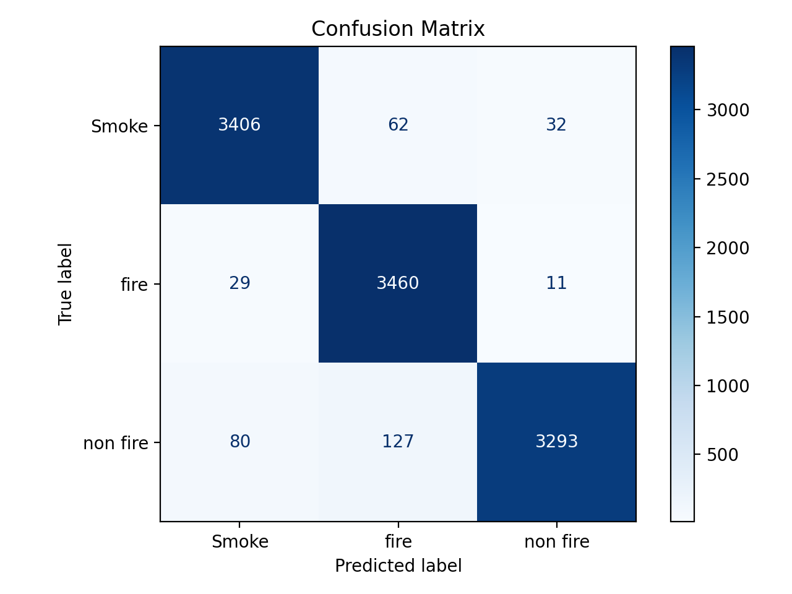

# FireVision: Fire, Smoke, and Non fire Classifier
## Problem Statement
Wildfires and accidental fires cause significant damage to lives, property, and the environment. Early detection of fire and smoke through automated image classification can dramatically improve response times and reduce damage. However, differentiating between fire, smoke, and non-hazardous scenes in images is challenging due to differences in lighting conditions and backgrounds.
<br><br>
This model addresses this challenge by using deep learning with PyTorch to classify images into three categories: fire, smoke, and non fire. This solution can help emergency responders and fire monitoring systems quickly and accurately identify potential fire hazards, which allows for faster intervention.

## Technologies
- Python, FastAPI
- Uvicorn
- PyTorch
- ONNX
- Scikit-learn
- React, TypeScript
- Docker
- GitHub Actions (CI/CD) 

## Project Structure
```md
├── app/ # Frontend
├── notebook.ipynb # EDA and model experimentation
├── train.py # Model training script
├── export.py # Export trained model to ONNX
├── predict.py # FastAPI inference service
├── test-api.py # API testing script
├── test-image.jpg # Sample testing image
├── smoke_fire_classifier.onnx
├── smoke_fire_classifier.pth
├── Dockerfile # Container configuration
├── pyproject.toml
└── README.md
```

## Dataset
Link: https://www.kaggle.com/datasets/amerzishminha/forest-fire-smoke-and-non-fire-image-dataset
<br>
Since the original dataset is very large, a subset of the dataset was created by randomly selecting 4,000 images per class from the training set (12,000 total images). Images were not included in the repository, and should be saved locally under ```images/train_small/``` and ```images/test/```. Since the images are randomly selected, results may be slightly different, but the procedure remains the same.
<br><br>
The original test set provided by the dataset was left unchanged and used for final evaluation.


## Model Training
Details on data exploration, model architecture, and hyperparameter tuning can be found in notebook.ipynb. The EfficientNet-B0 model was used, with key parameters including learning rate, inner size, and dropout rate tuned. 

## Model Performance
The model was evaluated on the test dataset and achieved strong performance overall.

| Metric (Macro Avg) | Score  |
|--------------------|--------|
| Accuracy           | 96.75% |
| Precision          | 96.81% |
| Recall             | 96.75% |
| F1-Score           | 96.75% |

### Per-Class Metrics

| Class    | Precision | Recall |  F1  |
|----------|-----------|--------|------|
| Smoke    | 0.97      | 0.97   | 0.97 |
| Fire     | 0.95      | 0.99   | 0.97 |
| Non-Fire | 0.99      | 0.94   | 0.96 |

- **Smoke**: Balanced precision and recall, indicating stable and consistent detection
- **Fire**: High recall (99%), indicating the model minimizes missed fire detections
- **Non-Fire**: High precision (99%), ensuring that hazardous conditions are rarely misclassified as safe

### Confusion Matrix


The confusion matrix shows strong diagonal dominance, indicating correct classification across all classes with limited confusion between fire and non-fire scenarios.


## Local Setup
1. Clone repository

2. Create a virtual environment:
```
uv venv .venv
```

3. Activate the virtual environment:
```
source .venv/Scripts/activate
```

4. Install dependencies:
```
uv sync
```

5. Train model
```
python train.py
python export.py
```

## Run backend API
### Option 1. Locally
```
uvicorn predict:app --port 9696
```

## Option 2. Docker
1. Build Docker Image
```
docker build -t firevision .
```

2. Run Docker Container
```
docker run -it --rm -p 9696:9696 firevision
```

The API will then be accessible at http://localhost:9696/predict.

Test prediction using sample data:
```
python test-api.py
```

Or

```
curl -X POST \
  http://localhost:9696/predict \
  -H "accept: application/json" \
  -F "file=@test-image.jpg"
```

Response
```
{
  "predicted_class": "fire",
  "predicted_class_display": "Fire", 
  "confidence": 0.9994840621948242,
  "probabilities": {
    "Smoke:" 0.00021710585861001164, 
    "Fire": 0.9994840621948242, 
    "Non-Fire": 0.00029882878880016506
  }
}
```

Push docker image to DockerHub:
```
docker tag firevision:latest <username>/firevision:latest

docker push <username>/firevision:latest
```

## Deploy to cloud
The docker image was deployed to the cloud using [Claw Cloud Run](https://us-west-1.run.claw.cloud/). 
1. Go to App Launchpad -> Create.
2. Under image, include docker image name: ```docker.io/<dockerhub username>/firevision:latest```
3. Under network, update container port to ```9696``` and allow public access

## Frontend
### Environment variables
Create ```.env``` in ```app/.env```
```
VITE_API_URL=""
```

```
npm install
npm run dev
```